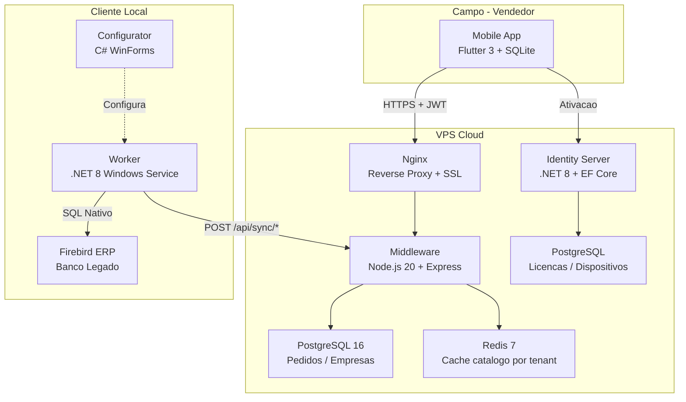
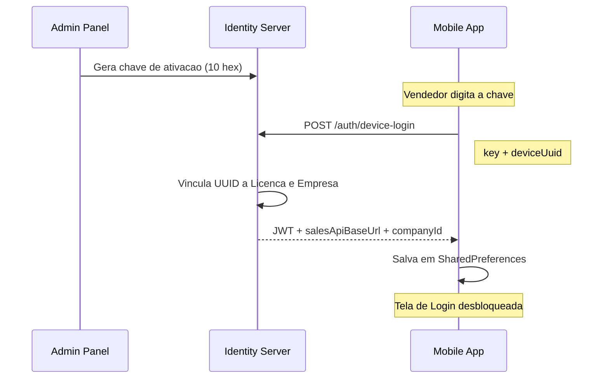
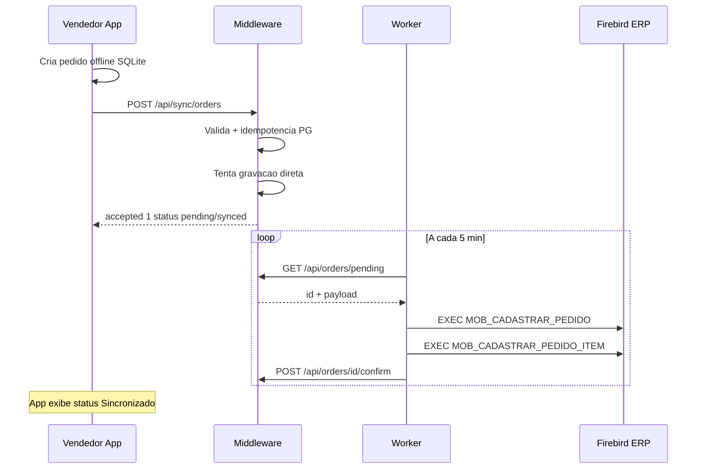
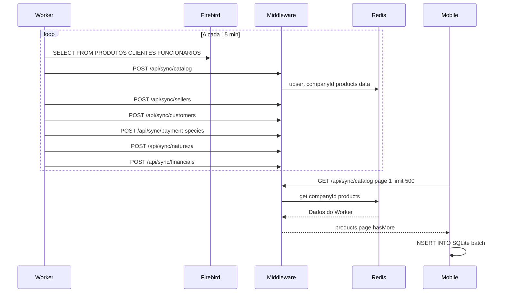
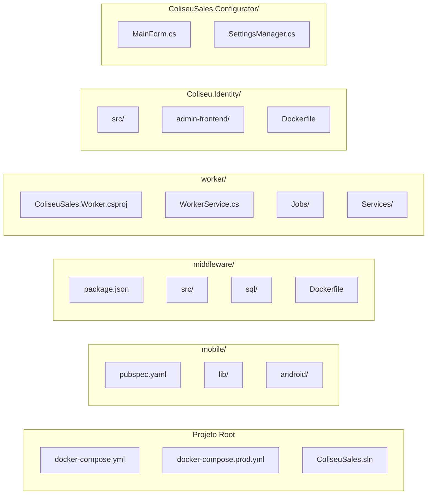

---
pdf_options:
  format: A4
  margin: 20mm
  printBackground: true
  headerTemplate: |-
    <style>
      section { font-family: 'Segoe UI', Arial, sans-serif; font-size: 8px; color: #888; width: 100%; padding: 0 20mm; }
      .left { float: left; }
      .right { float: right; }
    </style>
    <section>
      <span class="left">Coliseu Sales — Documentação Técnica</span>
      <span class="right">v1.0.3 — Março 2026</span>
    </section>
  footerTemplate: |-
    <section style="font-family: 'Segoe UI', Arial, sans-serif; font-size: 8px; color: #888; width: 100%; text-align: center; padding: 0 20mm;">
      Página <span class="pageNumber"></span> de <span class="totalPages"></span>
    </section>
  displayHeaderFooter: true
stylesheet: []
body_class: markdown-body
---

<div style="text-align: center; margin-top: 120px; margin-bottom: 80px;">
  <h1 style="font-size: 36px; color: #1a56db; margin-bottom: 10px;">Coliseu Sales</h1>
  <h2 style="font-size: 22px; font-weight: 400; color: #555;">Documentação Técnica Completa</h2>
  <hr style="width: 200px; margin: 30px auto; border: 2px solid #1a56db;" />
  <p style="font-size: 14px; color: #777;">Sistema multi-tenant de força de vendas mobile offline-first<br/>integrado com ERP Firebird</p>
  <br/><br/>
  <p style="font-size: 12px; color: #999;">Versão 1.0.3 — Março 2026</p>
</div>

<div style="page-break-after: always;"></div>

## Sumário

1. [Visão Geral](#1-visão-geral)
2. [Stack Tecnológica](#2-stack-tecnológica)
3. [Componentes Detalhados](#3-componentes-detalhados)
   - 3.1 Mobile App (Flutter)
   - 3.2 Middleware (Node.js + Express)
   - 3.3 Worker (.NET 8)
   - 3.4 Identity Server (.NET 8)
   - 3.5 Configurator (WinForms)
   - 3.6 API (.NET 8)
4. [Infraestrutura e Deploy](#4-infraestrutura-e-deploy)
5. [Fluxos de Negócio](#5-fluxos-de-negócio)
6. [Banco de Dados](#6-banco-de-dados)
7. [Versões e Builds](#7-versões-e-builds)
8. [Scripts e Utilitários](#8-scripts-e-utilitários)

<div style="page-break-after: always;"></div>

## 1. Visão Geral

O **Coliseu Sales** é um ecossistema completo para gestão de vendas externas. Permite que vendedores criem pedidos em campo (mesmo sem internet), sincronizando automaticamente com o ERP (Firebird) da empresa via uma arquitetura cloud intermediária.

### Arquitetura Macro



### Fluxo de Dados Resumido

| Dado | Origem | Destino | Mecanismo |
|------|--------|---------|-----------|
| Produtos, Clientes, Vendedores | Firebird → Worker | Redis (via Middleware) | Worker push a cada 15 min |
| Pedidos | Mobile App | PostgreSQL → Worker → Firebird | Push + polling |
| Financeiro (Títulos) | Firebird → Worker | Redis → Mobile | Sync periódico + on-demand |
| Ativação de Dispositivo | Mobile | Identity Server | Chave 10-char hex |

<div style="page-break-after: always;"></div>

## 2. Stack Tecnológica

### Componentes e Tecnologias

| Componente | Tecnologia | Linguagem | Porta |
|-----------|-----------|-----------|-------|
| **Mobile App** | Flutter 3 (Dart) | Dart | — |
| **Middleware** | Node.js 20, Express 4 | JavaScript | 3000 |
| **Worker** | .NET 8 (BackgroundService) | C# | — |
| **Identity Server** | ASP.NET Core 8, EF Core | C# | 8080 |
| **API (alternativa)** | ASP.NET Core 8, Minimal APIs | C# | 5000 |
| **Configurator** | WinForms (.NET) | C# | — |
| **Banco ERP** | Firebird 2.5/3.0 | SQL | 3050 |
| **Banco Cloud** | PostgreSQL 16 (Alpine) | SQL | 5432 |
| **Cache** | Redis 7 (Alpine) | — | 6379 |
| **Reverse Proxy** | Nginx | — | 80/443 |
| **Containerização** | Docker + Docker Compose | YAML | — |
| **Admin Panel** | React + Vite | TypeScript | — |

### Dependências Principais — Mobile (Flutter)

| Pacote | Função |
|--------|--------|
| `sqflite` | SQLite offline-first (banco local) |
| `dio` | HTTP client com interceptors (JWT) |
| `get_it` | Injeção de dependência (service locator) |
| `freezed` + `json_serializable` | Modelos imutáveis com serialização JSON |
| `fl_chart` | Gráficos no dashboard de desempenho |
| `mobile_scanner` | Leitura de código de barras (EAN-13, QR) |
| `connectivity_plus` | Status de rede |
| `flutter_local_notifications` | Notificações de pedido integrado |
| `share_plus` | Compartilhamento de pedidos (WhatsApp, email) |
| `device_info_plus` | UUID do hardware para device binding |
| `google_fonts` | Tipografia Inter com cache offline |
| `crypto` | SHA-256 para hash de PIN |
| `pdf` + `path_provider` | Geração de PDF de pedidos |
| `audioplayers` | Som de bip do scanner |

### Dependências Principais — Middleware (Node.js)

| Pacote | Função |
|--------|--------|
| `express` | Framework web principal |
| `ioredis` | Cliente Redis (cache multi-tenant) |
| `pg` | Driver PostgreSQL |
| `node-firebird` | Acesso direto ao Firebird (fallback) |
| `jsonwebtoken` | Verificação JWT de dispositivos |
| `helmet` | Headers HTTP de segurança |
| `cors` | Cross-Origin Resource Sharing |
| `express-rate-limit` | Proteção contra abuso |
| `winston` | Logging estruturado |
| `better-sqlite3` | SQLite para cenários locais |

<div style="page-break-after: always;"></div>

## 3. Componentes Detalhados

### 3.1 Mobile App (Flutter)

**Diretório:** `mobile/lib/`

#### Estrutura de Pastas

```
lib/
├── main.dart                    # Entry point + AuthGate
├── service_locator.dart         # GetIt DI setup
├── core/
│   ├── cart/                    # Gestão do carrinho de compras
│   ├── config/                  # AppConfigService (SharedPreferences)
│   ├── database/                # SQLite helper (migrations v1 a v15+)
│   ├── design/                  # AppTheme (light/dark)
│   ├── device/                  # UUID do hardware
│   ├── network/                 # ConnectivityService
│   ├── repositories/            # ProductRepository, modelos de dados
│   ├── services/                # SyncService, AutoSyncService
│   ├── session/                 # SessionService (login/logout)
│   └── sync/                    # Logica de sincronizacao
├── features/
│   ├── activation/              # Tela de ativacao do dispositivo
│   ├── auth/                    # Tela de login (selecao de vendedor + PIN)
│   ├── cart/                    # Carrinho de pedido
│   ├── catalog/                 # Catalogo de produtos (busca, barcode)
│   ├── customer_search/         # Busca de clientes
│   ├── customers/               # Lista de clientes + detalhes + financeiro
│   ├── home/                    # Tela principal com KPIs
│   ├── new_order/               # Criacao de novo pedido
│   ├── order_confirm/           # Confirmacao do pedido
│   ├── order_history/           # Historico de pedidos
│   ├── performance/             # Dashboard "Meu Desempenho" (graficos)
│   ├── profile/                 # Perfil do vendedor
│   ├── settings/                # Configuracoes do app
│   ├── setup/                   # Setup manual (URL, API Key)
│   ├── splash/                  # Splash screen
│   └── sync_queue/              # Fila de sincronizacao local
└── shared/                      # Widgets e utilitarios compartilhados
```

#### Funcionalidades do App

| Feature | Descrição |
|---------|-----------|
| **Ativação** | Vincula dispositivo à licença via chave de 10 caracteres hex |
| **Login** | Seleção de vendedor + PIN (hash SHA-256). Sem senha de rede |
| **Home** | KPIs do dia: pedidos, ticket médio, clientes atendidos, produtos |
| **Catálogo** | Busca por nome, código, marca ou código de barras. Scanner integrado |
| **Clientes** | Lista com busca, detalhes com posição financeira (títulos abertos/vencidos) |
| **Novo Pedido** | Seleção de cliente → natureza → produtos → pagamento → confirmação |
| **Carrinho** | Gestão de itens com quantidade, desconto e observações |
| **Histórico** | Lista de pedidos com filtro por período e status (pendente/sincronizado/erro) |
| **Desempenho** | Gráficos de vendas (line, bar, pie) usando dados confirmados pelo ERP |
| **Fila de Sync** | Visualização de pendências de sincronização |
| **Setup** | Configuração manual de URL, API Key e Identity URL |

#### Padrões Técnicos

- **Offline-First**: Dados armazenados em SQLite local. Sync em background a cada 15 min
- **AuthGate**: Fluxo Splash → Ativação → Login → Home controlado pelo widget `_AuthGate`
- **JwtInterceptor**: Anexa `Authorization: Bearer <token>`, `API-Key`, e `X-Company-Id`
- **AutoSyncService**: Ciclo automático de sincronização em background com notificação na UI
- **Cor azul** para títulos em aberto; **vermelho** para títulos vencidos

<div style="page-break-after: always;"></div>

### 3.2 Middleware (Node.js + Express)

**Diretório:** `middleware/src/`

#### Estrutura

```
src/
├── index.js              # Startup: inicia PostgreSQL, Redis, Firebird, PM2
├── app.js                # Express config: helmet, cors, rate-limit, rotas
├── config/
│   ├── env.js            # Variaveis de ambiente centralizadas
│   └── logger.js         # Winston structured logging
├── middleware/
│   ├── auth.js           # authenticateSyncRequest (JWT + API-Key dual auth)
│   ├── errorHandler.js   # Tratamento centralizado de erros
│   └── rateLimiter.js    # Rate limits por endpoint
├── routes/
│   ├── sync.js           # Sync bidirecional (Worker <-> Mobile) — ~1000 linhas
│   ├── orders.js         # CRUD de pedidos + confirmacao ERP
│   ├── kpi.js            # KPIs agregados de vendas
│   ├── events.js         # Audit trail de pedidos
│   ├── health.js         # Health check (PG, Redis, Firebird)
│   ├── metrics.js        # Metricas Prometheus
│   ├── cacheWarm.js      # Re-popular cache apos restart
│   └── admin/            # Gestao de empresas e webhooks
├── services/
│   ├── dataStore.js      # Abstracao Redis multi-tenant
│   ├── firebird.manager.js  # Pool de conexoes Firebird por tenant
│   ├── firebird.service.js  # Queries SQL ao Firebird ERP
│   ├── orderPersistence.js  # Persistencia de pedidos PostgreSQL
│   └── webhookService.js # Disparo de webhooks
└── db/
    ├── postgres.js       # Pool PostgreSQL + pgQuery helper
    ├── redis.js          # Conexao Redis + helpers
    └── migrate.js        # Migrations automaticas no startup
```

#### API Routes — Públicas (sem autenticação)

| Método | Rota | Descrição |
|--------|------|-----------|
| GET | `/health` | Status de PostgreSQL, Redis e Firebird |
| GET | `/metrics` | Métricas no formato Prometheus |

#### API Routes — Admin (requer `Admin-Api-Key`)

| Método | Rota | Descrição |
|--------|------|-----------|
| GET/POST | `/api/admin/companies` | Listar / criar empresas |
| PATCH | `/api/admin/companies/:id` | Ativar / desativar empresa |
| POST | `/api/admin/companies/:id/rotate-key` | Rotacionar API Key |
| GET/POST | `/api/admin/companies/:id/webhooks` | CRUD de webhooks |

#### API Routes — Sync (requer JWT ou API-Key)

| Método | Rota | Descrição |
|--------|------|-----------|
| POST | `/api/sync/catalog` | Worker → push produtos do Firebird |
| GET | `/api/sync/catalog` | Mobile ← pull catálogo (paginado, delta) |
| POST/GET | `/api/sync/sellers` | Workers sobe / Mobile lê vendedores |
| POST/GET | `/api/sync/customers` | Push/Pull de clientes |
| POST/GET | `/api/sync/payment-species` | Espécies de pagamento |
| POST/GET | `/api/sync/natureza` | Naturezas de operação |
| POST/GET | `/api/sync/financials` | Títulos financeiros |
| POST | `/api/sync/orders` | Mobile → cria pedidos (idempotente) |
| POST | `/api/sync/new-customer` | Mobile → cadastra cliente pendente |
| GET | `/api/sync/pending-customers` | Worker ← busca clientes para cadastrar |
| POST | `/api/sync/confirm-customer/:id` | Worker → confirma cadastro no ERP |
| PATCH | `/api/sync/update-customer/:id` | Atualiza telefone/e-mail no ERP |
| POST | `/api/sync/cache/warm` | Re-popular cache do Redis |

#### API Routes — Pedidos

| Método | Rota | Descrição |
|--------|------|-----------|
| GET | `/api/orders/pending` | Pedidos pendentes para o Worker |
| GET | `/api/orders/report` | Relatório paginado |
| GET | `/api/orders/kpi` | KPIs agregados |
| GET | `/api/orders/events` | Audit trail |
| POST | `/api/orders/:id/confirm` | Worker confirma integração ERP |

#### Segurança do Middleware

- **Helmet**: Headers HTTP defensivos
- **CORS**: Origens restringidas em produção
- **Rate Limiting**: Global + per-endpoint (catalog/orders)
- **Dual Auth**: JWT de dispositivo OU API-Key do Worker
- **Isolamento Multi-Tenant**: Toda query usa `company_id` da sessão autenticada

<div style="page-break-after: always;"></div>

### 3.3 Worker (.NET 8 — Windows Service)

**Diretório:** `worker/`

O Worker é um **Windows Service** instalado no cliente que sincroniza dados entre o Firebird ERP local e o Middleware cloud.

#### Jobs de Sincronização

| Job | Intervalo | Função |
|-----|-----------|--------|
| `HealthCheckJob` | Configurável | Verifica Firebird + VPS. Circuit-breaker (3+ falhas consecutivas) |
| `SyncCatalogJob` | ~15 min | Pusha produtos, clientes, vendedores, pagamentos, naturezas, financeiro |
| `SyncOrdersJob` | ~5 min | Puxa pedidos pendentes da VPS e grava no Firebird |
| `SyncAtendenteOrdersJob` | ~5 min | Sincroniza pedidos do módulo "Atendente do Futuro" |
| `SyncCustomerCreationJob` | ~5 min | Cadastra clientes pendentes no Firebird |
| `SyncSalesRankingsJob` | ~15 min | Pusha rankings de vendas (KPIs, "Meu Desempenho") |

#### Services

| Service | Função |
|---------|--------|
| `FirebirdService` | Queries SQL nativas ao Firebird (Stored Procedures) |
| `VpsApiClient` | HTTP client para o Middleware (push/pull via API) |
| `IdentityApiClient` | Busca credenciais Firebird dinâmicas do Identity Server |
| `MonitoringServer` | HTTP server local para status e "Forçar Sync" |
| `StatusStore` | Armazena último status de cada job |
| `AtendenteApiClient` | Client para módulo "Atendente do Futuro" |

#### Padrões

- **Circuit-Breaker**: Se Firebird falhar 3+ vezes seguidas, catalog sync é suspenso automaticamente
- **Delta Sync**: Usa `DATA_UP > @since` para enviar apenas alterações recentes
- **Credenciais Dinâmicas**: Busca config do Firebird via Identity API no startup
- **Force Sync**: Configurator pode forçar sync imediato via HTTP `POST /force-sync`

<div style="page-break-after: always;"></div>

### 3.4 Identity Server (.NET 8)

**Diretório:** `Coliseu.Identity/`

Gerencia **licenciamento, autenticação e multi-tenancy**.

#### Arquitetura (Clean Architecture)

```
src/
├── Coliseu.Identity.Api/         # Controllers + Middleware + Program.cs
│   ├── Controllers/
│   │   ├── AuthController.cs         # Login de dispositivo (JWT)
│   │   ├── AdminAuthController.cs    # Login administrativo
│   │   ├── CompaniesController.cs    # CRUD de empresas/tenants
│   │   ├── DevicesController.cs      # Gestão de dispositivos
│   │   ├── InternalController.cs     # Endpoints internos (Worker)
│   │   └── AuditController.cs        # Log de auditoria
│   └── Middleware/                   # ExceptionHandlingMiddleware
├── Coliseu.Identity.Application/    # Handlers + DTOs + Use Cases
├── Coliseu.Identity.Domain/         # Entidades + Enums + Interfaces
│   └── Entities/
│       ├── Company.cs               # Empresa/tenant
│       ├── Device.cs                # Dispositivo ativado
│       ├── Session.cs               # Sessao JWT
│       ├── AdminUser.cs             # Usuario admin
│       └── AuditLog.cs              # Log de auditoria
└── Coliseu.Identity.Infrastructure/ # EF Core + Repositorios
```

#### Funcionalidades

- **Ativação de Dispositivo**: Chave hex 10 chars → vincula UUID do hardware à empresa
- **JWT**: Gera tokens `Bearer` para dispositivos (vendedores) e administradores
- **CRUD de Empresas**: Nome, limites, config Firebird, API Keys
- **Gestão de Dispositivos**: Status (Active, Blocked, Awaiting Sync)
- **Audit Log**: Registra ações administrativas
- **Config Firebird**: Endpoint interno `/internal/companies/{id}/firebird-config` para Workers
- **Admin Frontend**: UI React + Vite para gestão

### 3.5 Configurator (C# WinForms)

**Diretório:** `ColiseuSales.Configurator/`

Aplicativo desktop utilizado por técnicos para configurar o Worker.

#### Funcionalidades

- **Configuração do Firebird**: Host, caminho do banco, credenciais
- **API Key e URL do VPS**: Conecta o Worker ao Middleware cloud
- **Tenant ID**: Vincula ao Identity Server
- **Teste de Conexão**: Valida Firebird e VPS antes de salvar
- **Instalar/Desinstalar Serviço**: Registra como Windows Service
- **Forçar Sincronização**: Envia sinal HTTP ao Worker para sync imediato
- **Status em Tempo Real**: Mostra status dos jobs do Worker

### 3.6 API (.NET 8 — Minimal APIs)

**Diretório:** `api/`

API alternativa em .NET com endpoints para admin e sync direta.

| Arquivo | Função |
|---------|--------|
| `SyncEndpoints.cs` | Sync completo — similar ao middleware |
| `OrderEndpoints.cs` | CRUD de pedidos |
| `AdminSalesEndpoints.cs` | Administração de vendas |
| `MonitoringEndpoints.cs` | Monitoramento e status |

<div style="page-break-after: always;"></div>

## 4. Infraestrutura e Deploy

### 4.1 Docker Compose

**Desenvolvimento** (`docker-compose.yml`):
- PostgreSQL 16, Redis 7, Middleware Node.js
- Portas expostas (5432, 6379, 3000)
- Volumes persistentes

**Produção** (`docker-compose.prod.yml`):
- Nginx como único ponto de entrada
- PostgreSQL e Redis sem portas expostas (rede interna)
- SSL via Let's Encrypt
- `restart: always` em todos os serviços

### 4.2 Segurança

| Camada | Mecanismo |
|--------|-----------|
| Transporte | HTTPS via Nginx + Let's Encrypt |
| Autenticação | JWT (`jsonwebtoken` / ASP.NET Core) |
| Autorização | API-Key por tenant + Admin-Api-Key |
| Rate Limiting | Por endpoint e por empresa |
| Headers | Helmet (CSP, X-Frame-Options, etc.) |
| Multi-Tenant | RLS no PostgreSQL + `company_id` obrigatório |
| Secrets | Chaves criptografadas, nunca em logs |

### 4.3 Variáveis de Ambiente Críticas

| Variável | Componente | Descrição |
|----------|-----------|-----------|
| `API_KEY` | Middleware | Chave padrão da empresa para sync |
| `ADMIN_API_KEY` | Middleware | Chave admin para gestão |
| `JWT_ACCESS_SECRET` | Middleware | Secret para verificar JWT de dispositivos |
| `PG_PASSWORD` | Middleware | Senha do PostgreSQL |
| `REDIS_URL` | Middleware | Connection string do Redis |
| `FB_MOCK` | Middleware | `true` = mock do Firebird (sem ERP real) |
| `SYNC_MODE` | Middleware | `direct` / `async` / `fallback` |
| `JWT_DEVICE_KEY` | Identity | Secret JWT para dispositivos (min 32 chars) |
| `JWT_ADMIN_KEY` | Identity | Secret JWT para admins |
| `INTERNAL_API_KEY` | Identity | Chave para chamadas internas (Worker) |
| `SALES_API_BASE_URL` | Identity | URL pública do Middleware |

<div style="page-break-after: always;"></div>

## 5. Fluxos de Negócio

### 5.1 Ativação de Dispositivo



### 5.2 Ciclo de Pedido



### 5.3 Sincronização do Catálogo



<div style="page-break-after: always;"></div>

## 6. Banco de Dados

### 6.1 PostgreSQL (Middleware)

Tabelas gerenciadas via migrations automáticas (`middleware/sql/`):

| Tabela | Função |
|--------|--------|
| `companies` | Cadastro de empresas/tenants com API Key (hash) |
| `orders` | Pedidos com status (pending/synced/error) e payload JSON |
| `pending_customers` | Clientes criados pelo mobile, pendentes de cadastro no ERP |
| `order_events` | Audit trail de eventos de pedidos |
| `schema_migrations` | Versionamento de DDL |

### 6.2 Firebird (ERP)

Stored Procedures utilizadas pelo sistema:

| Procedure | Função |
|-----------|--------|
| `MOB_CADASTRAR_PEDIDO` | Cria pedido (11 params) |
| `MOB_CADASTRAR_PEDIDO_ITEM` | Adiciona item ao pedido (7 params) |
| `MOB_CADASTRA_CLIENTE` | Cadastra novo cliente |

Views utilizadas:
- `MOB_LISTACLIENTES` — Clientes com dados de contato e vendedor
- `MOB_LISTACONTAS` — Títulos financeiros (abertos/pagos)

### 6.3 SQLite (Mobile)

Banco local com schema versionado (v1 a v15+):
- Produtos, clientes, vendedores, espécies de pagamento
- Pedidos locais com fila de sincronização
- Naturezas de operação
- Condições de pagamento
- Títulos financeiros

### 6.4 Redis (Cache)

Armazenamento multi-tenant por chave:

| Chave | Conteúdo |
|-------|----------|
| `{companyId}:products` | Catálogo completo |
| `{companyId}:sellers` | Vendedores habilitados |
| `{companyId}:customers` | Base de clientes |
| `{companyId}:paymentSpecies` | Formas de pagamento |
| `{companyId}:natureza` | Naturezas de operação |
| `{companyId}:financials` | Títulos financeiros |

<div style="page-break-after: always;"></div>

## 7. Versões e Builds

| Artefato | Versão | Arquivo |
|----------|--------|---------|
| Mobile APK | 1.0.3 | `ColiseuSales_1.0.3.apk` |
| Configurator | 1.0.2 | `ColiseuSales_Configurator_1.0.2.exe` |
| Middleware | 1.0.0 | Docker build |
| Worker | — | Self-contained publish |

### Comandos de Build

```bash
# Mobile (Release APK)
cd mobile
flutter build apk --release

# Middleware (Docker)
docker-compose -f docker-compose.prod.yml build middleware

# Worker (Windows publish)
cd worker
dotnet publish -c Release -r win-x64 --self-contained

# Identity Server (Docker)
cd Coliseu.Identity
docker-compose -f docker-compose.prod.yml build
```

## 8. Scripts e Utilitários

| Arquivo | Função |
|---------|--------|
| `start-all.bat` | Inicia todos os serviços localmente |
| `start-local.ps1` | Script PowerShell de dev local |
| `scripts/pg_backup.sh` | Backup do PostgreSQL |
| `worker/install_service.ps1` | Instala Worker como Windows Service |
| `worker/update-worker.ps1` | Atualiza Worker em produção |
| `middleware/scripts/onboard.js` | Onboarding de nova empresa |
| `middleware/ecosystem.config.js` | Configuração PM2 |

---

## 9. Mapa de Arquivos do Projeto



---

<div style="text-align: center; margin-top: 40px; color: #888; font-size: 12px;">
  <em>Documento gerado automaticamente — Coliseu Sistemas © 2026</em>
</div>
